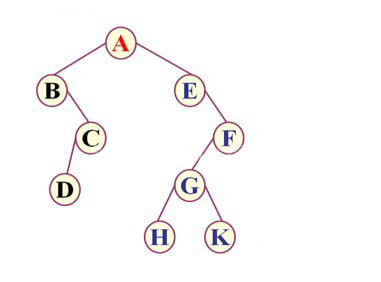

<center> 

## 二叉树的概念 ## 
</center>
<!-- more -->
```
二叉树（Binary Tree）是n（n≥0）个结点的有限集合，该集合或者为空集(称为空二叉树),
或者由一个根结点和两棵互不相交的、分别称为根结点的左子树和右子树的二叉树组成。

二叉树特点：
1.每个结点最多有两棵子树，所以二叉树中不存在度大于2的结点。没有子树或者有一棵子树
  是可以的，最多有两棵子树。
2.左子树和右子树是有顺序的，次序不能颠倒。
3.即使树中某结点只有一棵子树，也要区分它是左子树还是右子树。
```
二叉树具有五种基本形态：
1.空二叉树；2.只有一个根结点；3.根结点只有左子树；4.根结点只有右子树；5.根结点既有左子树又有右子树。

## 特殊二叉树 ##
### 斜树 ###
所有的结点都**只有左子树**的二叉树叫 ** 左斜树 **。所有的结点都是**只有右子树**的二叉树叫 **右斜树**。这二者统称为**斜树**。斜树有明显特点，每一层都只有一个结点，结点的个数和二叉树的深度相同。斜树和线性表结构一样，**线性表结构是树的一种特殊表现形式。**
### 满二叉树 ###
在一棵二叉树中，如果所有分支结点都存在左子树和右子树，并且**所有叶子都在同一层上**，这样的二叉树称为满二叉树。单是每个节点都存在左右子树，不能算是满n二叉树，还必须要所有的叶子结点都在同一层上，这样就做到了整棵树的平衡。所以，满二叉树的特点是：1.**叶子只能出现在最下一层**，出现在其他层就不能达到平衡；2.**非叶子结点的度一定是2**；3.在同样深度的二叉树中，**满二叉树的结点最多，叶子数最多。**
### 完全二叉树 ###
对一棵具有n个结点的二叉树 按层序编号 ，如果编号为i（1≤i≤n）的结点与同样深度的满二叉树中编号为i的结点在二叉树中位置完全相同，则这颗二叉树称为完全二叉树。

**完全二叉树的特性：
（1）叶子结点只能出现在最下两层。
（2）最下层的叶子一定集中在左部连续位置。
（3）倒数第二层，若有叶子结点，一定都在右部连续位置。
（4）如果结点度为1，则该结点只有左孩子，即不存在只有右子树的情况。
（5）同样结点数的二叉树，完全二叉树的深度最小。**
### 二叉树的性质 ###
性质一：在二叉树的第i层上至多有 2i−1 个结点（i≥1）。—–归纳法

性质二：深度为k的二叉树至多有 2k−1 个结点（k≥1）。—–归纳法

性质三：对任何一棵二叉树T，如果其终端结点数为 n0，度为2的结点数为 n2，则 n0=n2+1。
```
设 n1 为度是1的结点数，那么T结点总数 n=n0+n1+n2.换个角度，数数连接连线，
因为根结点只有分支出去，没有分支进入，所以分支线总数为结点总数减去1，
分支线总数为 n−1=n1+2n2 ，两个式子相减得到 n0=n2+1。
```
性质四：具有n个结点的完全二叉树的深度为 |log2n|+1（其中|x|表示不大于x的最大整数）。

性质五：如果对一棵有n个结点的完全二叉树（深度为 |log2n|+1）的结点按层序编号（从第1层到第 |log2n|+1层，每层从左到右），对任一结点i（1≤i≤n）有：
1.如果 i=1，则结点i是二叉树的根，无双亲；如果 i>1，则其双亲是结点|i/2|。
2.如果2i>n，则结点i无左孩子（结点i为叶子结点）；否则其左孩子是结点2i。
3.如果2i+1>n，则结点i无右孩子；否则其右孩子是结点2i+1。

## 二叉树的存储结构 ##
### 二叉树顺序存储结构 ###

二叉树比较特殊，所以可以使用顺序存储结构可以实现。二叉树的顺序存储结构就是用一维数组存储二叉树中的结点，并且结点的存储位置，也就是数组的下标要能体现结点之间的逻辑关系，例如双亲与孩子的关系，左右兄弟的关系等等。完全二叉树的存储可以根据**结点的编号**来存储，一般的二叉树，尽管**层序编号**不能反映逻辑关系，但是可按**完全二叉树编号**，将不存在的结点设置为“∧”。若是考虑极端情况，例如右斜树，k个结点，却分配 2k−1 个存储单元空间，浪费了存储空间。所以，**顺序存储结构一般只用于完全二叉树。**

## 二叉树的遍历 ##
例如:



** 先序遍历：ABCDEFGHK **

** 中序遍历：BDCAEHGKF **

** 后序遍历：DCBHKGFEA **

以中序遍历为例：

中序遍历的规则是【左根右】，我们从root节点A看起；

此时A是根节点，遍历A的左子树；

A的左子树存在，找到B，此时B看做根节点，遍历B的左子树；

B的左子树不存在，返回B，根据【左根右】的遍历规则，记录B，遍历B的右子树；

B的右子树存在，找到C，此时C看做根节点，遍历C的左子树；

C的左子树存在，找到D，由于D是叶子节点，无左子树，记录D，无右子树，返回C，根据【左根右】的遍历规则，记录C，遍历C的右子树；

C的右子树不存在，返回B，B的右子树遍历完，返回A；

至此，A的左子树遍历完毕，根据【左根右】的遍历规则，记录A，遍历A的右子树；

A的右子树存在，找到E，此时E看做根节点，遍历E的左子树；

E的左子树不存在，返回E，根据【左根右】的遍历规则，记录E，遍历E的右子树；

E的右子树存在，找到F，此时F看做根节点，遍历F的左子树；

F的左子树存在，找到G，此时G看做根节点，遍历G的左子树；

G的左子树存在，找到H，由于H是叶子节点，无左子树，记录H，无右子树，返回G，根据【左根右】的遍历规则，记录G，遍历G的右子树；

G的右子树存在，找到K，由于K是叶子节点，无左子树，记录K，无右子树，返回G，根据【左根右】的遍历规则，记录F，遍历F的右子树；

F的右子树不存在，返回F，E的右子树遍历完毕，返回A；

至此，A的右子树也遍历完毕；


最终我们得到上图的中序遍历为BDCAEHGKF，无非是按照遍历规则来的；

根据“中序遍历”的分析，相信先序遍历和后序遍历也可以轻松写出~